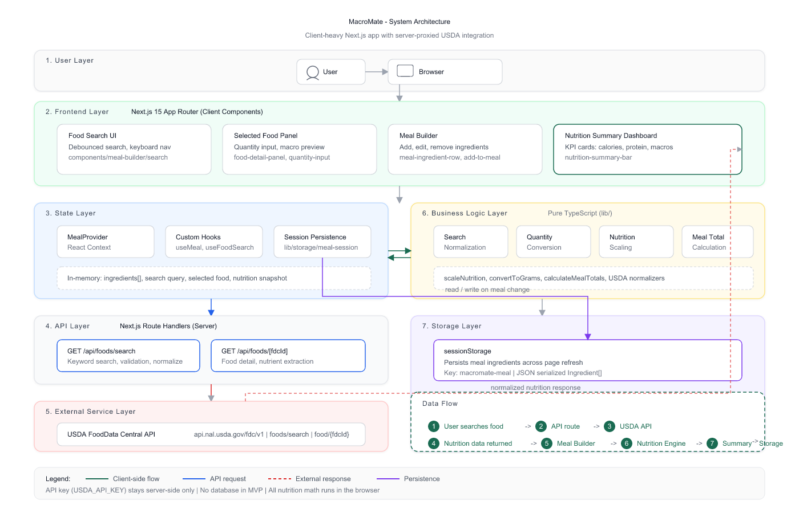

# MacroMate

Build custom meals and calculate calories and macronutrients in under one minute — powered by [USDA FoodData Central](https://fdc.nal.usda.gov/).

**Live demo:** _Add your Vercel URL after deployment_

---

## Problem Statement

Fitness-focused individuals often eat custom meals with multiple ingredients, but calculating nutrition means jumping between labels, search engines, and spreadsheets. That friction makes it hard to hit protein and calorie targets consistently.

MacroMate solves this with a single workflow: **search → quantity → add → summary**.

---

## Features

- **USDA food search** — debounced search with loading, empty, and error states
- **Search normalization** — common names (e.g. omelette, paneer bhurji, roti) map to USDA-friendly terms
- **Quantity input** — grams, milliliters, or servings (when USDA serving data exists)
- **Meal builder** — add, edit, and remove multiple ingredients
- **Nutrition summary** — calories, protein, carbs, fat, and fiber totals
- **Session persistence** — meal survives page refresh via `sessionStorage`
- **Keyboard search** — arrow keys, Enter, and Escape for mouse-free selection
- **Mobile-friendly layout** — responsive meal builder with accessible tap targets

---

## Tech Stack

| Layer | Technology |
|-------|------------|
| Framework | Next.js 15 (App Router) |
| Language | TypeScript |
| Styling | Tailwind CSS v4 |
| Data source | USDA FoodData Central API v1 |
| State | React Context + custom hooks |
| Persistence | `sessionStorage` (meal only) |
| Tests | Vitest + Testing Library |

---

## Architecture



MacroMate is a **client-heavy, server-proxied** Next.js application. The browser owns meal state and all nutrition calculations; the Next.js server acts as a thin API proxy to USDA FoodData Central, keeping the API key off the client.

### Layers

| Layer | Role |
|-------|------|
| **User** | Interacts via the browser to search foods, configure quantities, and build meals. |
| **Frontend (Next.js)** | Four UI surfaces: Food Search, Selected Food Panel, Meal Builder, and Nutrition Summary Dashboard. |
| **State** | `MealProvider` (React Context), custom hooks (`useMeal`, `useFoodSearch`), and session persistence sync meal data in memory and to `sessionStorage`. |
| **API** | Server route handlers `/api/foods/search` and `/api/foods/[fdcId]` validate input, proxy requests, and normalize USDA responses. |
| **External Service** | USDA FoodData Central API provides food search and per-100g nutrient profiles. |
| **Business Logic** | Pure TypeScript functions handle search normalization, quantity conversion, nutrition scaling, and meal total calculation. |
| **Storage** | `sessionStorage` persists the ingredient list across page refresh (no database in MVP). |

### Data flow

1. User searches for a food in the browser.
2. The frontend calls a Next.js API route.
3. The route proxies the request to USDA FoodData Central.
4. Normalized nutrition data is returned to the client.
5. The user adds ingredients to the meal builder.
6. The nutrition engine scales macros by quantity.
7. The summary dashboard updates meal totals.
8. Ingredients are saved to `sessionStorage`.

See [`docs/technical_architecture.md`](docs/technical_architecture.md) for the full technical write-up.

---

## Getting Started

### Prerequisites

- Node.js 18+
- npm
- [USDA FoodData Central API key](https://fdc.nal.usda.gov/api-key-signup.html) (free)

### Setup

```bash
git clone <your-repo-url>
cd MacroMate
npm install
cp .env.example .env.local
```

Add your API key to `.env.local`:

```env
USDA_API_KEY=your_key_here
```

Start the development server:

```bash
npm run dev
```

Open [http://localhost:3000/meal-builder](http://localhost:3000/meal-builder).

### Scripts

| Command | Description |
|---------|-------------|
| `npm run dev` | Start development server |
| `npm run build` | Production build |
| `npm run start` | Run production server locally |
| `npm test` | Run unit tests |
| `npm run lint` | ESLint |

---

## Environment Variables

| Variable | Required | Description |
|----------|----------|-------------|
| `USDA_API_KEY` | Yes | USDA FoodData Central API key (server-side only) |
| `USDA_API_BASE_URL` | No | Override API base URL (default: `https://api.nal.usda.gov/fdc/v1`) |

See [`.env.example`](.env.example) for a template. **Never commit `.env.local` or expose the API key to the browser.**

---

## Project Structure

```
app/                  Next.js routes and API handlers
components/           UI components (meal-builder, layout, ui)
lib/                  Nutrition logic, USDA client, search aliases, hooks
providers/            React Context (MealProvider)
types/                Shared TypeScript types
phases/               Phase-based development docs (0–6)
docs/                 Planning and architecture docs
```

Phase deliverables and code-path mapping: [`phases/README.md`](phases/README.md)

---

## Screenshots

Add portfolio screenshots to [`docs/screenshots/`](docs/screenshots/) after deployment:

| File | Description |
|------|-------------|
| `meal-builder-empty.png` | Empty meal builder with search |
| `meal-builder-search.png` | Search results with alias notice |
| `meal-builder-ingredients.png` | Meal with multiple ingredients |
| `meal-builder-mobile.png` | Mobile layout |
| `nutrition-summary.png` | Nutrition totals panel |

Example markdown once images are added:

```markdown

```

---

## Documentation

| Document | Purpose |
|----------|---------|
| [`DEPLOYMENT.md`](DEPLOYMENT.md) | Vercel deployment and production setup |
| [`PORTFOLIO_SUMMARY.md`](PORTFOLIO_SUMMARY.md) | Case study for PM portfolio |
| [`docs/PRODUCTION_VERIFICATION_CHECKLIST.md`](docs/PRODUCTION_VERIFICATION_CHECKLIST.md) | Pre-launch QA checklist |
| [`docs/mvp_blueprint.md`](docs/mvp_blueprint.md) | Full MVP architecture |
| [`docs/implementation_plan.md`](docs/implementation_plan.md) | Phase-by-phase build plan |

---

## Future Roadmap

**Post-MVP (not in scope today):**

- Saved meals and recent searches
- Natural language meal entry
- Daily nutrition dashboard
- Weight and goal tracking
- Personalized calorie/protein targets

See [`docs/roadmap.md`](docs/roadmap.md) for the full product roadmap.

---

## License

Private / portfolio project — update as needed.
